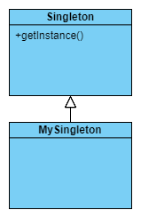

Design Pattern
==============
Exercises of design pattern in Python

Table of Content
----------------

* [Strategy Pattern](#strategy-pattern)
* [Oberver Pattern](#observer-pattern)
* [Decorator Pattern](#decorator-pattern)
* [Factory Pattern](#factory-pattern)
* [Singleton Pattern](#singleton-pattern)
* [Command Pattern](#command-pattern)
* [Adapter Pattern](#adapter-pattern)
* [Facade Pattern](#facade-pattern)
* [Template Method Pattern](#template-method-pattern)

Strategy Pattern
-------------------
### Definition
Strategy pattern is that we try to find out the changed parts, and encapsulate it. This pattern make the core algorithms be alternated easily without effecting the current program which is not related with changed parts.

### Rules
1. **Encapsulate changed parts**
2. **Use composition more, inheritance less**
3. **Write program based on interface instead of implementation**

### Example
A duck example:
Here we design a duck abstract class with two kinds of abilities (algorithm), that are flying and quacking. Leter, due to flying and quacking behavior are different for different types of duck, we encapsulate both two functionality into two separately class for easily changing.

### Applications
* neuron network -> activation function
* read/write -> compression algorithm

Observer Pattern
-------------------
### Definition
Observer pattern is that when we have one writer and many readers, then we can use observer pattern to realize it.

### Rules
1. Encapsulate changed parts
2. Use composition more, inheritance less
3. Write program based on interface instead of implementation
4. **Loosen the coupling between objects**

### Example
A weather example:
There is an subject in the example named weather. The subject is responsible for getting the weather data from other class and maintaining the registration of observers. There could be many observers for different purpose, but all of them have to register to subject in order to receive the updated weather data.

### Applications
* task progress
* event driven pattern -> if one event comes, subject broadcast to all listeners.

Decorator Pattern
-----------------
### Definition
Decorator means wrappers of a function or class, and make them have addtional behavior. It is allowed to change the behavior completely, but usually decorator dose the decorating job, meaning that it add more function and keep the object's original purpose.

### Rules
1. Encapsulate changed parts
2. Use composition more, inheritance less
3. Write program based on interface instead of implementation
4. Loosen the coupling between objects
5. **Class should be open for expanding and close for protection of unchange part**

### Example
A beverage example:
First, we have different sorts of beverage with different costs. There are some condiment can "decorate" the original beverage. After decorating, the beverage is endowed with new taste, new cost, and new a description.

### Applications
* credential access -> check credential before each access action
* cache -> check database before each access action
* Logging -> log before enter a function and after leave a function
* Timing -> get timestamp before and after a function and then get time cost
* lock -> acquire lock before do things

Factory Pattern
---------------
### Definition
* Factory methods: a method which can return a general class object having different implementation deceiding by the sub class
* Abstract Factory: an abstract class describes a product family and includes a set of factory methods for construct family products.

### Rules
1. Encapsulate changed parts
2. Use composition more, inheritance less
3. Write program based on interface instead of implementation
4. Loosen the coupling between objects
5. Class should be open for expanding and close for protection of unchange part
6. **Depends on abstarct class instead of concrete class**

### Example
A pizza store example:
In the example, there is a general pizza class providing the basic steps of making it. The pizza store uses a absract factory method called createPizza to get a general pizza object for a standard cooking process. However, the actual behavior could different for each pizza according to its read subclass.
  
Furthermore, there is a abstract factory class called ingredient factory. The ingredient factory has a general interface to control all the creation of all the family conponent.

### Applications
* Transfer Agent -> each provide the same transfer concept, but has different implementation

Singleton Pattern
--------------------
### Definition
Singleton pattern is that we only have a unique instance for a class in a runtime.

### Rules
1. Encapsulate changed parts
2. Use composition more, inheritance less
3. Write program based on interface instead of implementation
4. Loosen the coupling between objects
5. Class should be open for expanding and close for protection of unchange part
6. Depends on abstarct class instead of concrete class

### Example
A thread singleton example:
The example is quite simple. We only implement a singleton class and make sure that all instances coming from the singleton class are actually the same instance.

### Applications
* global variable/function/flag
* single handler
* request sender (avoid to login everytime)

Command Pattern
---------------
### Definition
Users can send different command requests regardless how those command actual work. So the command pattern loose the tie between the user and commands and keep the flexibility of extanding more different commands in the future.

### Rules
1. Encapsulate changed parts
2. Use composition more, inheritance less
3. Write program based on interface instead of implementation
4. Loosen the coupling between objects
5. Class should be open for expanding and close for protection of unchange part
6. Depends on abstarct class instead of concrete class

### Example
A remote controller example:
The remote controller is an interface between users and commands. Users only need to know how to use the remote controller and don't have to know the implementation of commands. Further, the controller can decide how to execute the command or even "when" to execute the command.

### Applications
* job queue -> user send different tasks requests without knowing how those tasks work and job queue decideds when to execute them.

Adapter Pattern
---------------
### Definition
Once there is an old or exsiting library/subsystem, and now the main system have to cowork with the library/subsystem. However, the interfaces between exsisting library and main system are different, and then we can create an adapter as the interface converter for old or exsiting library, and use it without modifying it.

### Rules
1. Encapsulate changed parts
2. Use composition more, inheritance less
3. Write program based on interface instead of implementation
4. Loosen the coupling between objects
5. Class should be open for expanding and close for protection of unchange part
6. Depends on abstarct class instead of concrete class

### Example

Because this pattern is quite straightforward, here only show the class diagram without using an example.

### Applications
* using c library in python -> need an adaptor to wrapper interface
* using third party library -> may not change the library e.g. VMware VDDK

Facade Pattern
---------------
### Definition
Facade pattern provide a unified interface to access a group of interfaces in a subsystem. Besides, facade pattern set up a higher level interface to make thoses subsystem more easily be used.

### Rules
1. Encapsulate changed parts
2. Use composition more, inheritance less
3. Write program based on interface instead of implementation
4. Loosen the coupling between objects
5. Class should be open for expanding and close for protection of unchange part
6. Depends on abstarct class instead of concrete class
7. **Talk to intimate friends, not friend's friends**

### Example

Because this pattern is quite simple, here only show the class diagram without using an example.

### Applications
* controller e.g. backup controller -> controll many subsystem to finish the backup operation

Template Method Pattern
---------------
### Definition
### Rules

### Example

### Applications

