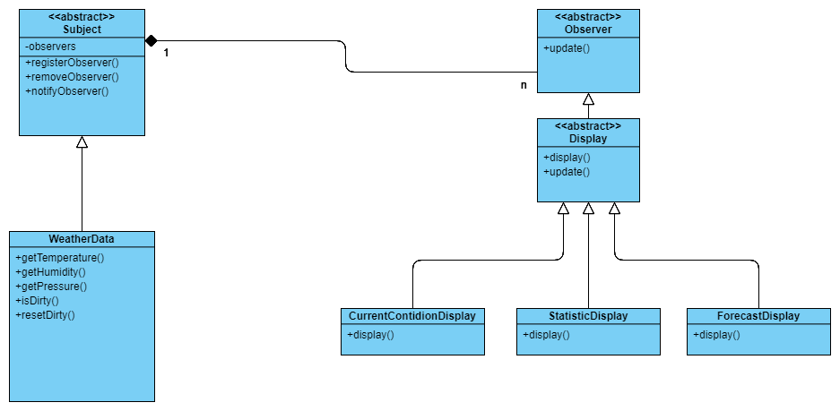

# Observer Pattern

## Basic Skill
1. Abstract Class
2. Encapsulation

## Rules
1. Encapsulate changed parts
2. Use composition more, inheritance less
3. Loosen the coupling between objects

## Pattern
Observer pattern is that when we have one writer and many readers and then we can use observer pattern to realize it.

## Application
* progress
* event driven pattern

## Class Diagram
An weather example:

