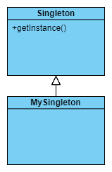

# Singleton Pattern

## Basic Skill
1. Thread safe
2. Class static

## Rules
1. Make sure whole times only one instance exists
2. Provide an global interface to get this instance

## Pattern
Singleton pattern is that when we have one instance in a program runtime. Moreover, at any time there always has an interface to get the instance.

## Application
* Global variable/function/flag
* Single handler
* Request sender (avoid to login everytime)

## Class Diagram
An singleton example: 

