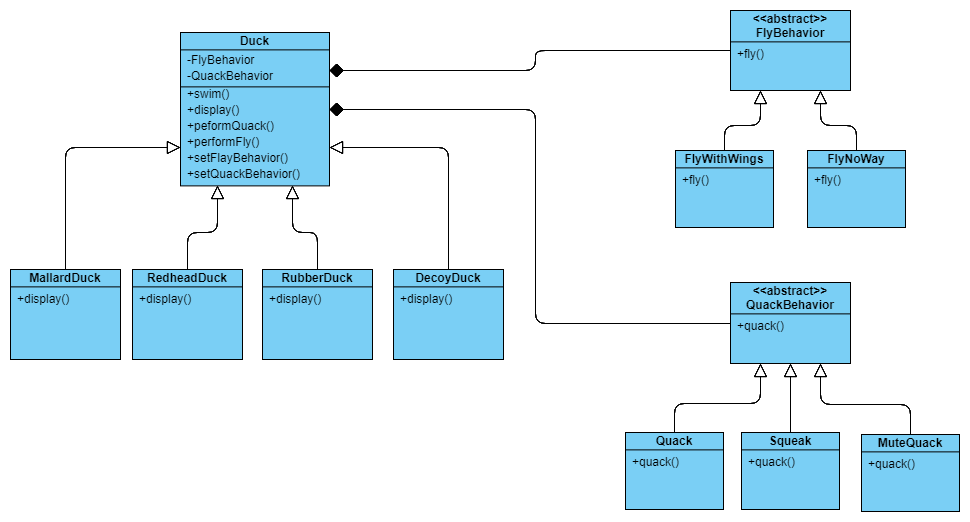

# Strategy Pattern

## Basic Skill
1. Abstract Class
2. Encapsulation
3. Polymorphism
4. Inheritance

## Rules
1. Encapsulate changed parts
2. Use composition more, inheritance less
3. Write program based on interface instead of implementation

## Pattern
Strategy pattern is that we try to find out the changed parts, and encapsulate it. This pattern make the core algorithms can be alternated easily without effect the current program which is not related with changed parts.

## Application
* neuron network -> activation function
* read/write -> compression algorithm

## Class Diagram
An duck example:

